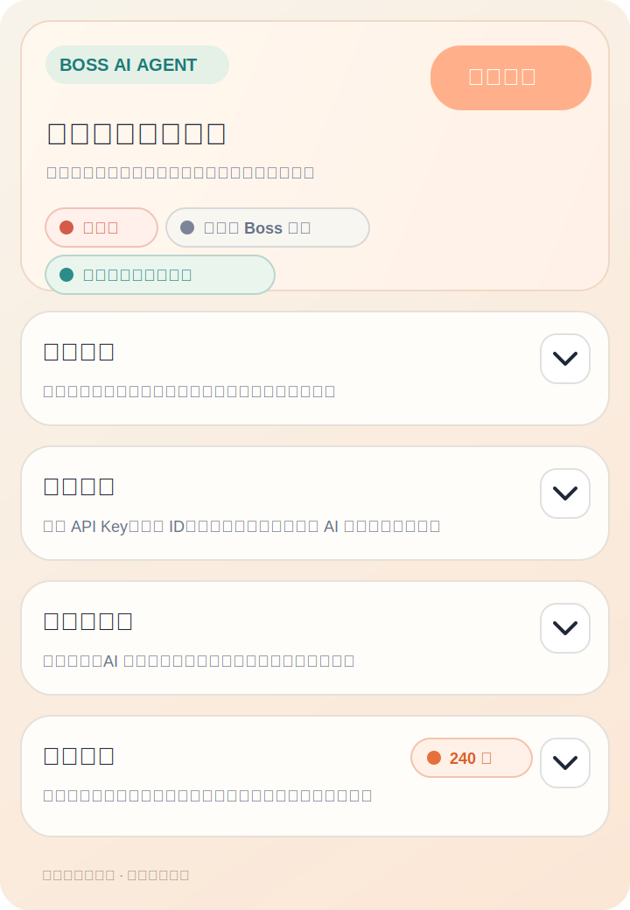
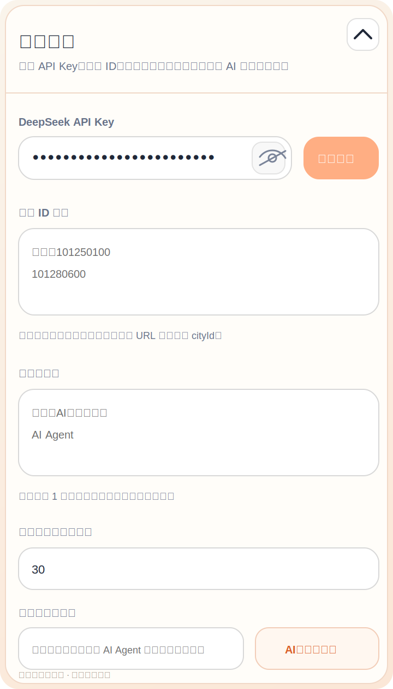

# Boss AI Agent 浏览器插件

一个面向个人求职场景的浏览器插件项目，用于在 Boss 直聘网页端完成职位浏览、简历整理、岗位匹配与自动沟通的辅助流程。

当前仓库已经完全收敛为浏览器插件架构，所有核心能力都运行在 `extension/` 目录中，不再依赖历史上的命令行入口。

> 以下文档中的界面图为基于真实插件界面整理的脱敏版示意图，已经替换或移除了个人文件名、履历亮点等敏感信息，更适合公开放在 GitHub 仓库首页展示。

## 界面预览

<table>
  <tr>
    <td align="center" width="33%">
      
    </td>
    <td align="center" width="33%">
      
    </td>
    <td align="center" width="33%">
      
    </td>
  </tr>
  <tr>
    <td align="center"><strong>首页总览</strong></td>
    <td align="center"><strong>插件配置</strong></td>
    <td align="center"><strong>简历工作台</strong></td>
  </tr>
</table>

## 项目简介

这个项目的目标是把求职过程中的几类重复操作集中到浏览器插件里完成：

- 在插件中录入 API Key
- 在插件中上传和整理简历
- 在插件中配置多个城市 ID 和多个搜索关键词
- 在职位列表页自动执行搜索、浏览、匹配评分
- 对高匹配岗位自动进入沟通流程并生成消息

整个流程以浏览器插件为中心，不再需要把配置写死在代码里，也不再依赖额外的本地命令行脚本。

## 功能特点

- 全插件化操作：API Key、简历文本、城市 ID、搜索关键词都在插件中维护
- 多城市轮换：支持配置多个 `cityId`，按组合轮流执行
- 多关键词轮换：支持配置多个搜索关键词，自动组合遍历
- 关键词智能生成：可根据一段岗位描述自动生成一组更适合搜索框使用的关键词
- 总点击上限：支持限制一次运行内累计最多点击多少个岗位，降低连续点击过多带来的风控风险
- 简历工作台：支持上传 `.docx`、`.txt`、`.md`，并可通过 AI 整理为更适合匹配的候选人档案
- 自动匹配评分：抓取岗位信息后，调用 AI 输出匹配分数、原因和沟通消息
- 自动沟通辅助：对满足条件的岗位自动进入聊天流程并发送生成消息
- 可视化运行状态：在插件弹窗中查看执行状态、页面状态、日志和缓存情况
- 本地数据存储：插件配置与运行缓存保存在浏览器本地，不再硬编码到仓库

## 使用场景

适合以下类型的个人使用场景：

- 需要长期筛选同类岗位的人
- 需要在多个城市和多个关键词之间重复搜索的人
- 希望先用 AI 对简历进行提炼后再参与岗位匹配的人
- 希望把职位浏览、筛选和初始沟通流程尽量收敛到同一个插件里的人

## 安装方式

1. 打开 Chrome 或 Edge 的扩展管理页面
2. 开启“开发者模式”
3. 选择“加载已解压的扩展程序”
4. 选择仓库中的 `extension/` 目录
5. 安装完成后，点击浏览器工具栏中的插件图标打开弹窗

## 打包方式

项目已经内置打包脚本，不需要额外安装前端构建工具。

### 生成可加载目录

```bash
npm run build
```

执行后会生成：

```text
dist/unpacked/
```

这个目录可直接用于本地加载或手动检查打包结果。

### 生成发布 ZIP 包

```bash
npm run package
```

执行后会生成：

```text
dist/boss-ai-agent-v版本号.zip
```

压缩包内会直接以插件文件作为根目录内容，包含 `manifest.json`，适合用于插件发布或分发。

### 打包说明

- 打包脚本会校验 `package.json` 与 `extension/manifest.json` 的版本号是否一致
- 每次打包前会自动清空并重建 `dist/`
- `dist/unpacked/` 始终保存当前最新的一份插件构建结果

## 使用步骤

1. 在插件中填写并保存 DeepSeek API Key
2. 配置至少 1 个城市 ID
3. 配置至少 1 个搜索关键词，或先通过描述自动生成一组关键词
4. 按需设置“本次运行总点击上限”
5. 上传简历文件，或手动粘贴简历文本
6. 按需点击“AI 整理”生成整理版简历
7. 打开 Boss 直聘职位列表页
8. 在插件右上角点击“开始执行”

满足以下条件后，插件才允许开始执行：

- 已保存 API Key
- 至少填写 1 个城市 ID
- 至少填写 1 个搜索关键词
- 已上传或填写简历内容

## 配置说明

### 1. 城市 ID

城市 ID 需要在插件中手动配置，支持填写多个。

获取方式：

- 先在 Boss 直聘职位列表页切换到目标城市
- 查看浏览器地址栏中的链接参数
- 例如：

```text
https://www.zhipin.com/web/geek/jobs?city=101250100&query=AI%E5%BA%94%E7%94%A8%E5%B7%A5%E7%A8%8B%E5%B8%88
```

其中 `city=101250100` 里的 `101250100` 就是城市 ID。

插件也支持直接粘贴完整职位列表 URL，会自动提取其中的 `cityId`。

### 2. 搜索关键词

搜索关键词同样在插件中配置，支持填写多个。

示例：

```text
AI应用工程师
AI Agent
AIGC应用开发
```

如果你暂时没有整理好关键词，也可以直接输入一段岗位描述，由插件调用 AI 自动生成一组更适合 Boss 搜索框使用的关键词，再合并到关键词输入框中。

### 3. 本次运行总点击上限

你可以设置从“开始执行”到“停止执行”这一整次运行里，累计最多点击多少个岗位。

用途：

- 限制整次运行内的累计点击数量
- 所有城市和关键词组合共享同一个总上限
- 达到上限后自动停止执行
- 用于降低连续点击过多带来的风控风险

如果不主动调整，当前默认值为 `30`。

### 4. 简历

简历支持以下方式导入：

- 上传 `.docx`
- 上传 `.txt`
- 上传 `.md`
- 直接粘贴纯文本

插件会优先使用“AI 整理版简历”参与匹配；如果没有整理版，则回退使用原始简历文本。

## 自动执行逻辑

当前版本的自动执行逻辑遵循以下规则：

- 不自动启动，必须由用户手动点击“开始执行”
- 启动和停止共用同一个按钮
- 切换城市和关键词时，不再通过页面城市选择器操作
- 插件会直接改写职位列表页 URL 中的城市和搜索参数
- 页面加载完成后，会强制点击一次“搜索”按钮
- 只有在完成这一步之后，才会开始继续抓取和匹配

这套逻辑的目的是让搜索行为尽量稳定，并减少因为页面状态残留导致的执行异常。

## 运行中可见能力

插件弹窗中可以直接完成以下操作：

- 查看当前执行状态
- 查看当前页面类型与阶段
- 打开职位列表页
- 刷新状态和运行日志
- 清空岗位缓存
- 上传、编辑、整理和清空简历

## 项目结构

```text
boss-ai-agent/
├── extension/
│   ├── background.js
│   ├── content.js
│   ├── inject.js
│   ├── manifest.json
│   ├── popup.html
│   ├── popup.js
│   └── vendor/
│       └── mammoth.browser.min.js
├── .env.example
├── .gitignore
├── package.json
└── README.md
```

目录说明：

- `extension/background.js`：插件后台逻辑、配置存储、日志记录、AI 请求入口
- `extension/content.js`：Boss 页面内容脚本，负责页面行为控制和自动执行
- `extension/inject.js`：页面注入脚本
- `extension/popup.html`：插件弹窗界面
- `extension/popup.js`：插件弹窗交互逻辑
- `extension/vendor/mammoth.browser.min.js`：浏览器端解析 `.docx` 的依赖

## 数据与隐私说明

- API Key 由用户在插件中手动输入
- 配置和运行缓存保存在浏览器本地存储中
- 简历文本默认保存在插件本地，用于岗位匹配和简历整理
- 岗位匹配与简历整理会请求外部 AI 接口

如果你准备二次开发或公开部署，建议先自行确认：

- 是否符合你所在地区的法律法规
- 是否符合目标网站的使用规则
- 是否符合你对个人隐私和数据处理的预期

## 开源说明

当前仓库主要用于个人插件化求职流程整理，也欢迎基于此继续改造。

如果你准备将它作为公开项目继续维护，建议补充以下内容：

- `LICENSE`
- 更新日志
- 示例截图
- 常见问题
- 风险提示与合规说明

## 提醒

本项目更适合作为个人学习、自动化研究和流程整理示例使用。请在了解相关平台规则、账号风险和数据安全边界的前提下自行使用。
